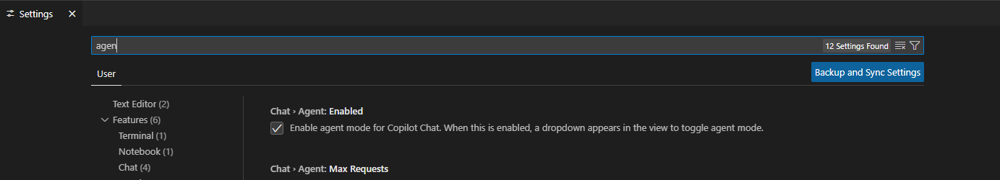
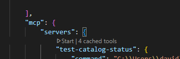
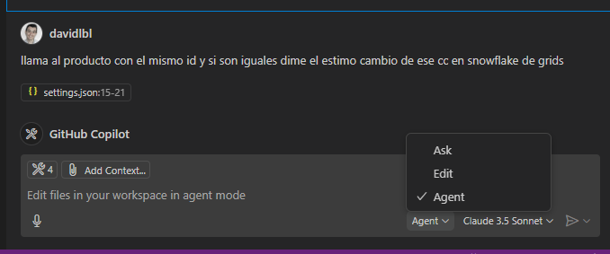
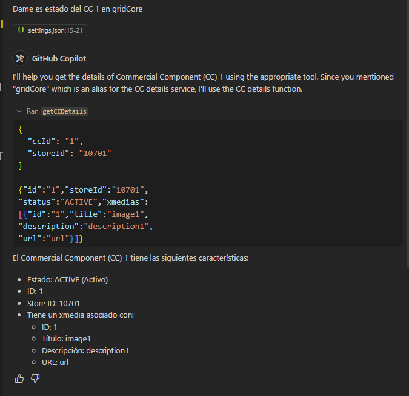

# catalog-api-mcp-server
Piloto de herramienta para validar o gestionar el estado de P&C

### Configuración

Inicialmente, se debera activar en VSC el agente de MCP



Después, dentro del VSC en el fichero settings.json agregar la siguiente configuración:

```
"mcp": {
        "servers": {
            "test-catalog-status": {
                "command": "{{JAVA_HOME}}",
                    "args": [
                        "-jar",
                        "{{LOCAL_PATH}}\\catalog-api-mcp-server\\target\\catalog-api-mcp-server-0.0.1-SNAPSHOT.jar"
                    ]
            }
        }
    }
```

Se debera iniciar el servidor MCP dandole a `start`



Al iniciar, se debera seleccionar la opción de agent y aparecerán todas las `tools` configuradas, la cuales permitirá interactuar con el servidor MCP en local



### Validación

Ya teniendo todo, se podrá preguntar información que tenga el MCP, según lo configurado en las [tools definidas](./src/main/java/com/inditex/catalog_api_mcp_server/service/EcommerceService.java#29)

